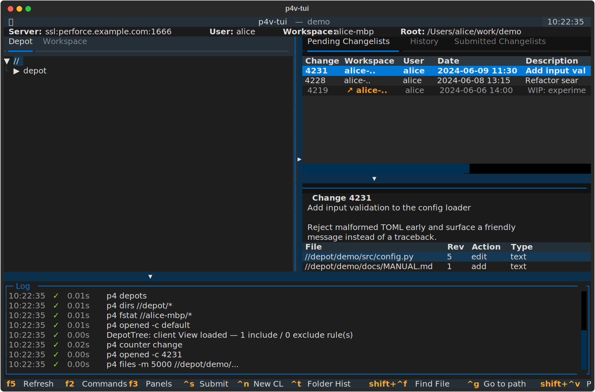
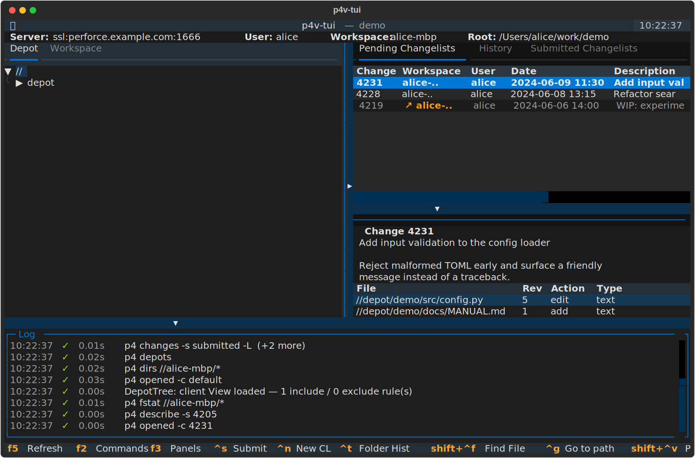
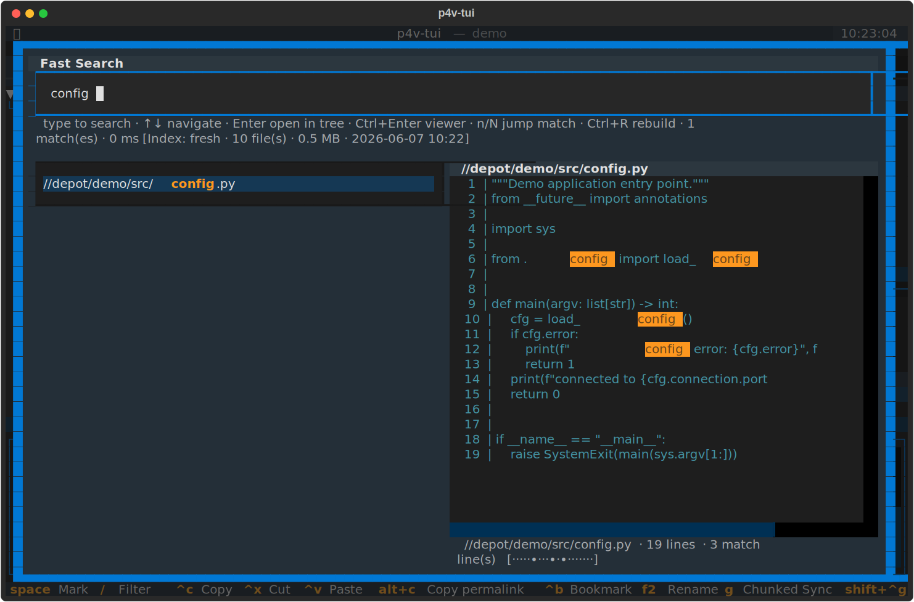
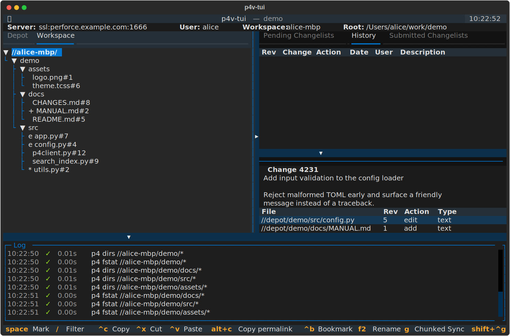
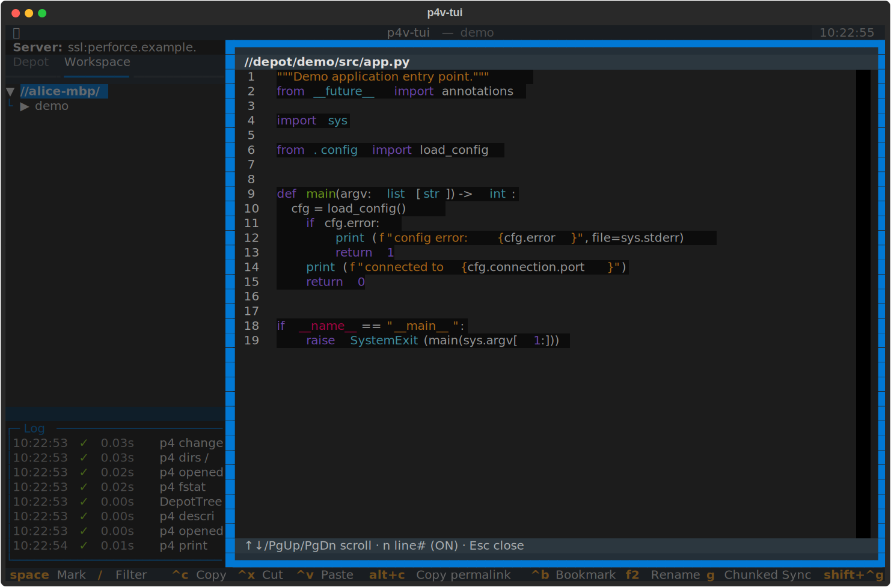

# p4v-tui — 연결 안정성에 특화된 Perforce TUI 클라이언트

[Textual](https://textual.textualize.io/) 기반의 터미널 UI Perforce(Helix)
클라이언트. 표준 p4v 의 일상 워크플로(get / edit / submit / revert /
reconcile / 히스토리 조회)를 키보드 중심으로 다루면서, **느리거나 끊기는
네트워크에서도 안정적으로 동작**하도록 설계되었다.



p4v 는 단일 호출이 길게 DB 락을 잡고 끊기면 처음부터 다시 해야 하지만,
p4v-tui 는 모든 장기 작업을 작은 청크로 분해해 진행 상태를 디스크에
영속화한다. 도중에 종료되어도 다음 실행에서 정확히 끊긴 지점부터 이어
받을 수 있다.

- Python 단일 진입점, 외부 데몬·플러그인 없음
- iPhone Blink(폭 80셀) 같은 좁은 터미널에서도 사용 가능(자동 narrow 모드)
- Hangul IME 가 켜진 상태에서도 단일 글자 단축키 동작(2-beolsik jamo alias)

> 📖 **전체 사용법 · 화면별 스크린샷 · 단축키 레퍼런스는
> [`docs/MANUAL.md`](docs/MANUAL.md) 에 있습니다.** 내부 설계는
> [`DESIGN.md`](DESIGN.md) 참조.

## 왜 만들었는가

비프로그래머 입장에서 평소 p4v 를 쓰며 **답답했던 점들을 직접 고치고,
원하는 기능을 계속 얹을 수 있는 파운데이션을 만들기 위해서** 다.

지금까지 해소된 답답함:

- **텍스트 파일 빠르게 보기** — p4v 는 외부 viewer 를 거쳐야 하지만,
  여기서는 트리에서 `Enter` 한 번이면 풀스크린 popup 으로 즉시 열린다
  (5MB 청크 렌더).
- **거대한 작업이 멈추지 않게** — 수만 파일 단위 sync / reconcile / clean
  을 청크로 분해해 진행 상태를 디스크에 저장. 도중 종료해도 재개. 작업
  중에도 인터랙티브 명령이 청크 사이에 끼어들어 UI 가 멈추지 않는다.
- **종료 시 깔끔한 정리** — 청크 작업 중 `q` 로 종료해도 현재 청크만 마저
  끝내고 안전하게 종료. 다음 실행에서 미완료 작업 picker.
- **한국어 환경 대응** — Hangul IME on 상태의 단일 글자 단축키, CJK 글자
  폭 truncate, 한글 description 정상 표시.

## 둘러보기

| | |
|---|---|
|  |  |
| **워크스페이스 간 Pending CL** — 내 모든 워크스페이스의 미서브밋 CL 을 한 화면에. 다른 워크스페이스 CL 은 `↗` 마커로 구분. | **Fast Search** (`Ctrl+F`) — 로컬 SQLite 인덱스 기반 타이핑-즉시 결과 + 미리보기 + 매치 하이라이트. |
|  |  |
| **Workspace 트리** — 파일 앞 1글자 상태 마커(`e`/`+`/`*`/…). | **파일 뷰어** — 트리 leaf 에서 `Enter`, 우측 절반에 구문 강조로 즉시. |

각 화면의 자세한 설명과 더 많은 스크린샷(Depot 트리 · Submitted/History ·
Command Monitor · Go to path · Narrow 모드 · 컨텍스트 메뉴)은
[`docs/MANUAL.md`](docs/MANUAL.md) 에 있습니다.

## 빠른 시작

```bash
python3 -m venv .venv && source .venv/bin/activate
pip install -r requirements.txt        # textual>=8, (선택) p4python
python p4v.py
```

- Perforce 백엔드는 **P4Python 또는 `p4` CLI** 중 하나면 됩니다(자동 선택,
  `P4V_BACKEND=python|cli` 로 강제).
- 설정은 **선택** — 없으면 P4 환경 변수 / `P4CONFIG` 를 그대로 사용합니다.
  `[[profile]]` 이 둘 이상이면 시작 시 picker 로 고릅니다.
- 루트의 `p4v` 래퍼를 PATH 에 두면(`ln -sf "$PWD/p4v" ~/.local/bin/p4v`)
  어디서든 `p4v` 한 줄로 실행되고, `.venv` 가 없으면 자동 부트스트랩합니다.

설치(PEP 668 우회 포함) · 백엔드 튜닝 · 설정 파일 전체 키는
[`docs/MANUAL.md` §2–4](docs/MANUAL.md#2-설치) 참조.

## 주요 기능 (요약)

표준 p4v 가 제공하지 않는, 이 클라이언트만의 추가 기능 위주. 완전한 1:1
커버리지 매트릭스는 [`DESIGN.md`](DESIGN.md) 의 "p4v Feature Coverage"
섹션, 각 기능의 사용법은 [`docs/MANUAL.md`](docs/MANUAL.md) 참조.

- **① 연결 안정성** — 자동 재연결 + 백오프 재시도, 청크 + 재개 가능
  sync / revert / reconcile / clean, lost-ack idempotent submit, 재시작 시
  미완료 작업 picker, 설정 가능한 청크 전략. → [MANUAL §12](docs/MANUAL.md#12-연결-안정성-resilience)
- **② 운영 가시성** — Command Monitor(`F2`, 부모-자식 트리 + ETA), 하단
  스크롤 Log 패널. → [MANUAL §11](docs/MANUAL.md#11-command-monitor--log)
- **③ Pending 강화** — 워크스페이스 간 Pending CL, local/remote 액션 게이팅,
  30s 자동 새로고침, Default CL 격리. → [MANUAL §7](docs/MANUAL.md#7-pending-changelists)
- **④ 검색 / 탐색** — Fast Search(`Ctrl+F`), Go to path(`Ctrl+G`), Find
  File, 트리 클립보드(`Ctrl+C/X/V`), 퍼머링크(`Alt+C`)·북마크(`Ctrl+B`).
  → [MANUAL §10](docs/MANUAL.md#10-fast-search--go-to-path--find-file)
- **⑤ 좁은 터미널 / 한글 / 키보드** — narrow 모드 페이지 네비게이터,
  Hangul jamo 단축키 alias, CJK 폭 truncate. → [MANUAL §13](docs/MANUAL.md#13-narrow-모드--한글--키보드)
- **⑥ 영속되는 작업 환경** — 패널 크기 · 활성 탭 · 포커스 · 정렬을
  `state.json` 에 저장/복원.
- **⑦ p4v 그대로 + 안전장치** — 파일 뷰어, Get Revision 다이얼로그, Copy
  Swarm URL, Resolve/Shelve 풀 사이클, Annotate / Time-lapse / Revision
  Graph / Undo / File Properties / Tag with Label / Side-by-side·Arbitrary
  diff, 친절한 누락 의존성 안내.

## 앞으로 (Roadmap)

기존 p4v 사용 시 답답했던 점을 계속 고쳐 나간다. 최근 사이클에 완료된 것:

- ✅ **Swarm URL 자동 생성** — Submitted / Pending CL 컨텍스트 메뉴의 "Copy
  Swarm Review URL" / "Open in Swarm" (`{base}/changes/{N}`).
- ✅ **퍼포스 경로 자유도** — Fast Search / Find File / Go-to-path 에 공통
  token-AND loose 매칭 + Levenshtein "did you mean…" fallback.
- ✅ **자연어 검색** — Fast Search 의 `nl:` prefix(시간 표현·사용자
  anchor·CL 토큰·한국어 동사 인식).
- ✅ **인터랙티브 resolve / shelve** — `Ctrl+E` 인앱 3-way 머지 에디터,
  부분 shelve picker.
- ✅ **경로 추적 / 북마크 / 다중선택** — `Ctrl+G` Go-to-path, `Alt+C`
  퍼머링크, `Ctrl+B`/`Ctrl+Shift+B` 북마크, `Space` 트리 다중선택.
- ✅ **제출 안전성 / 이슈 연동** — 제출 전 미해결·대용량·빈 CL 가드,
  `[jira]` Jira 이슈 검출/경고, 백엔드 표시.
- ✅ **작업 매크로** — `[[macro]]` TOML 블록 + `Ctrl+Shift+M` picker + 개별
  키바인딩.

기능 우선순위는 사용자 피드백에 따라 조정된다. 새 답답함 발견 시
issue / merge request 환영.

## 디렉토리 구조

```
p4v-tui/
├── README.md                   # 이 파일 — 개요 + 둘러보기
├── docs/MANUAL.md              # 상세 사용 설명서 (스크린샷 포함)
├── docs/image/                 # 매뉴얼/README 스크린샷 (SVG, 자동 생성)
├── DESIGN.md                   # 상세 설계서 + p4v 기능 커버리지
├── CLAUDE.md                   # 에이전트/LLM 진입점
├── LICENSE                     # MIT
├── requirements.txt            # textual (+ 선택 p4python)
├── requirements-dev.txt        # pytest
├── p4v-tui.toml.example        # 설정 파일 템플릿
├── p4v.py                      # 진입점 — `python p4v.py`
├── p4v                         # venv 자동 부트스트랩 래퍼
├── scripts/
│   ├── gen_screenshots.py      # 헤드리스 SVG 스크린샷 생성기
│   └── demo_backend.py         # 스크린샷용 합성 Perforce 백엔드
└── p4v_tui/
    ├── app.py                  # P4VApp (Textual) — 핵심 lifecycle + 액션
    ├── app_shared.py / app_menus.py / app_details.py / app_diffrev.py
    ├── config.py               # TOML 설정 로더 + writer
    ├── p4client.py             # P4Service façade + P4Python / p4 CLI 백엔드
    ├── jobs.py chunking.py sync_job.py bulk_jobs.py submit_job.py  # resilience
    ├── submit_guards.py jira.py pending_jobs.py
    ├── search_index.py search_jobs.py     # Fast Search
    ├── path_nav.py permalink.py bookmarks.py merge3.py  # (순수, 테스트됨)
    ├── cmd_log.py state.py utils.py messages.py fs_actions.py
    ├── styles.tcss
    └── widgets/                # 모달 · 트리 · 패널 (자세한 목록은 DESIGN.md)
```

## 한계 및 미구현

자세한 p4v 기능별 커버리지 매트릭스는 [`DESIGN.md`](DESIGN.md) 의 "p4v
Feature Coverage" 섹션 참조. 큰 그림:

- **Operational + inspection 영역 전부 커버** — sync / edit / submit /
  revert / reconcile / clean / branch-copy-integrate + Resolve / shelve 풀
  사이클 / Annotate / Time-lapse / Revision Graph / Undo / File Properties
  / Tag / Side-by-side·Arbitrary diff / Get Revision / Find File / Fast
  Search / 트리 클립보드 / Preferences / Open With … 인앱에서 모두 처리.
- **Admin / Metadata 뷰** — ⏭ 의도적 비대상. Workspaces / Branch Mappings /
  Streams / Jobs / Users / Groups / Permissions / Triggers / 풀 Label
  editor 는 spec 편집 surface 라 표준 `p4` CLI 가 더 적합. TUI 는 일상
  개발 루프에 집중.
- **Login / Logout / Set Password / Tickets UI** — ⏭ 의도적 비대상.
  외부 `p4 login` / `p4 logout` / `p4 passwd` 로 인증. SSO / 2FA / ticket
  처리를 인앱에서 중복 구현하지 않고 security boundary 를 `p4` CLI 한 곳에
  둔다.
- **다중 connection profile 의 add / edit** — Preferences 는 단일
  `[connection]` 만 편집. `[[profile]]` 추가/삭제는 TOML 직접 편집(picker 는
  제공).

## 라이선스

MIT License

Copyright (c) 2026 p4v-tui contributors

Permission is hereby granted, free of charge, to any person obtaining a copy
of this software and associated documentation files (the "Software"), to deal
in the Software without restriction, including without limitation the rights
to use, copy, modify, merge, publish, distribute, sublicense, and/or sell
copies of the Software, and to permit persons to whom the Software is
furnished to do so, subject to the following conditions:

The above copyright notice and this permission notice shall be included in all
copies or substantial portions of the Software.

THE SOFTWARE IS PROVIDED "AS IS", WITHOUT WARRANTY OF ANY KIND, EXPRESS OR
IMPLIED, INCLUDING BUT NOT LIMITED TO THE WARRANTIES OF MERCHANTABILITY,
FITNESS FOR A PARTICULAR PURPOSE AND NONINFRINGEMENT. IN NO EVENT SHALL THE
AUTHORS OR COPYRIGHT HOLDERS BE LIABLE FOR ANY CLAIM, DAMAGES OR OTHER
LIABILITY, WHETHER IN AN ACTION OF CONTRACT, TORT OR OTHERWISE, ARISING FROM,
OUT OF OR IN CONNECTION WITH THE SOFTWARE OR THE USE OR OTHER DEALINGS IN THE
SOFTWARE.
