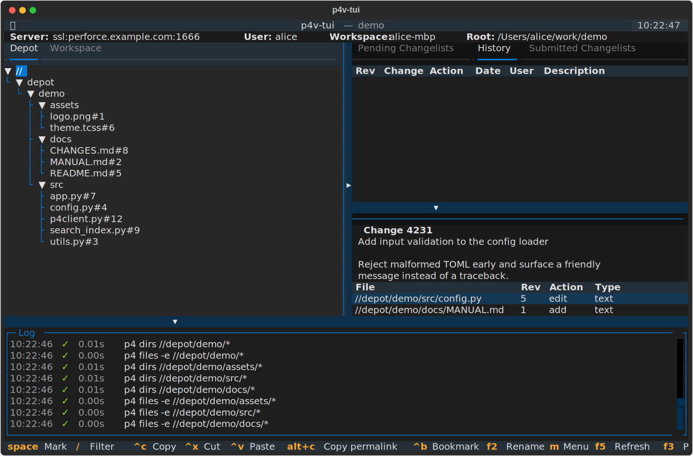
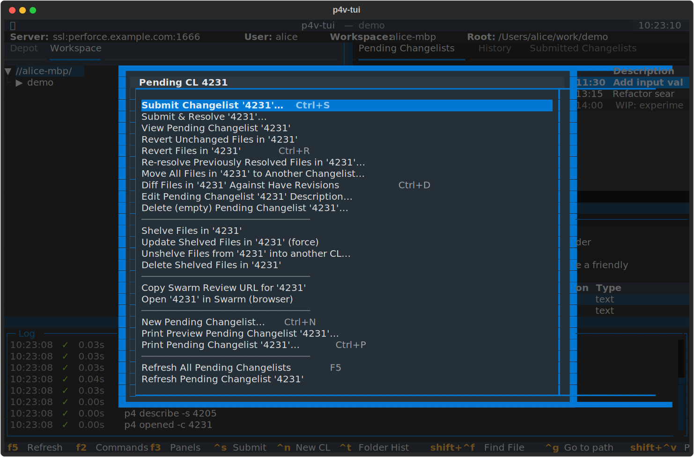
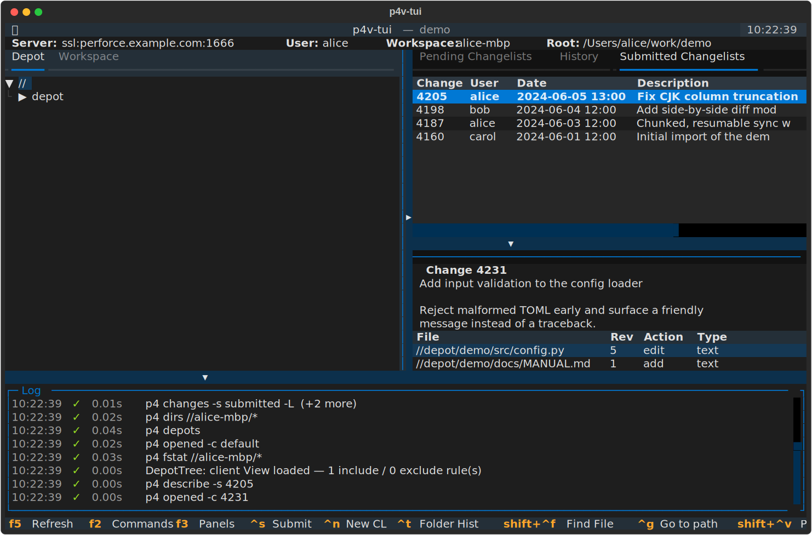
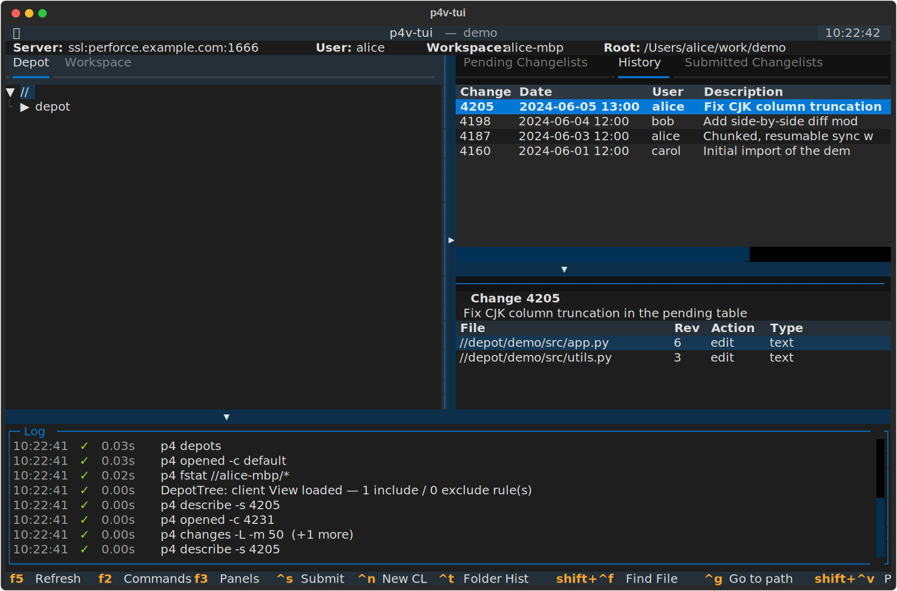
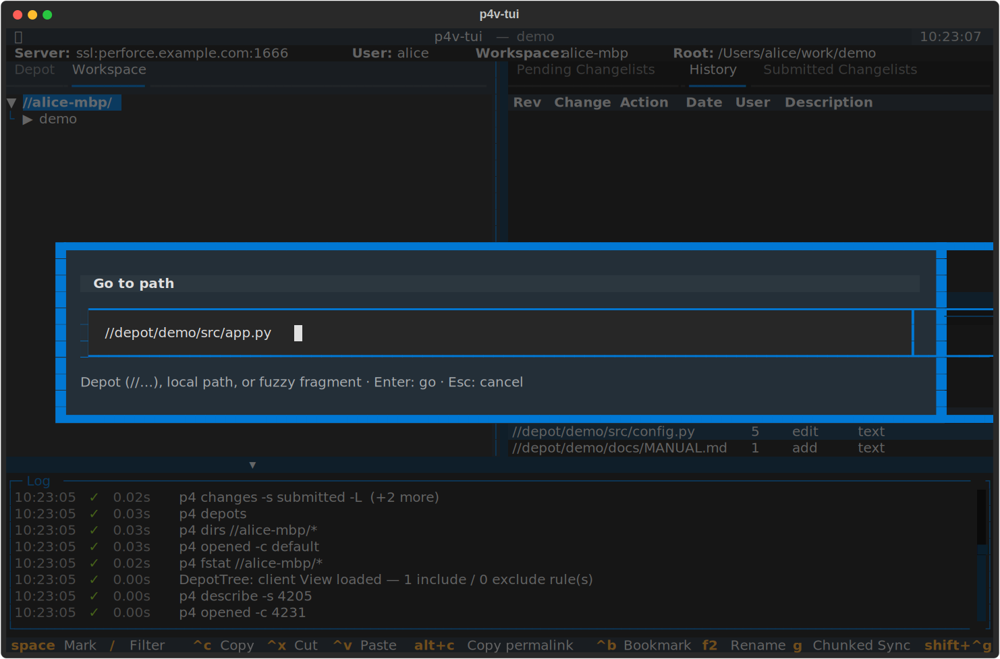
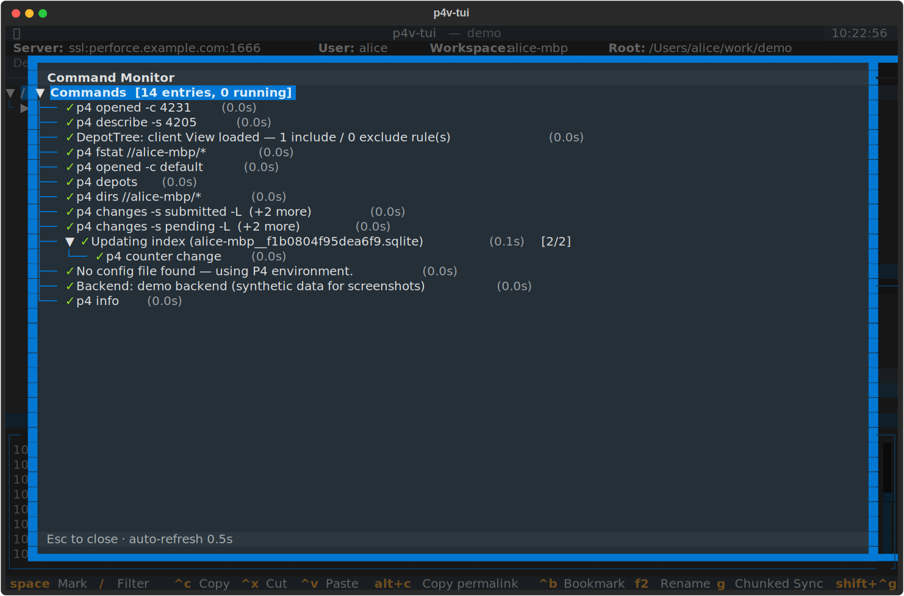
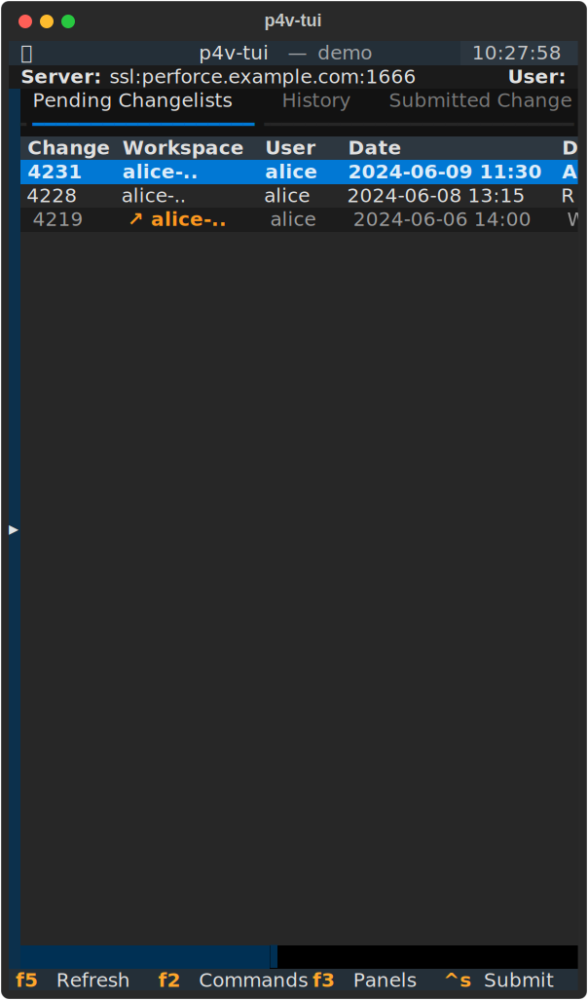

# p4v-tui 사용 설명서 (Manual)

[Textual](https://textual.textualize.io/) 기반 터미널 UI Perforce(Helix)
클라이언트의 상세 사용 설명서. 빠르게 훑어보려면 루트의
[`README.md`](../README.md), 내부 설계가 궁금하면
[`DESIGN.md`](../DESIGN.md) 를 보세요. 이 문서는 **각 화면과 기능을 실제
스크린샷과 함께** 처음부터 끝까지 다룹니다.

> 이 문서의 스크린샷은 모두 **합성 데모 데이터**(가상의 서버
> `ssl:perforce.example.com:1666`, 사용자 `alice`, 워크스페이스
> `alice-mbp`, depot `//depot/demo/...`)로 생성됩니다. 실제 앱을 헤드리스로
> 구동해 그대로 캡처한 것이며(`scripts/gen_screenshots.py`), 목업이
> 아닙니다. 재생성 방법은 [부록 A](#부록-a--스크린샷-재생성)를 참고하세요.

---

## 목차

1. [무엇인가](#1-무엇인가)
2. [설치](#2-설치)
3. [실행 & 짧은 명령](#3-실행--짧은-명령)
4. [설정 파일](#4-설정-파일)
5. [화면 구성](#5-화면-구성)
6. [Workspace / Depot 트리](#6-workspace--depot-트리)
7. [Pending Changelists](#7-pending-changelists)
8. [Submitted / History](#8-submitted--history)
9. [파일 보기 (File Viewer)](#9-파일-보기-file-viewer)
10. [Fast Search · Go to path · Find File](#10-fast-search--go-to-path--find-file)
11. [Command Monitor & Log](#11-command-monitor--log)
12. [연결 안정성 (Resilience)](#12-연결-안정성-resilience)
13. [Narrow 모드 · 한글 · 키보드](#13-narrow-모드--한글--키보드)
14. [단축키 전체 레퍼런스](#14-단축키-전체-레퍼런스)
15. [트러블슈팅 / FAQ](#15-트러블슈팅--faq)
16. [부록 A — 스크린샷 재생성](#부록-a--스크린샷-재생성)

---

## 1. 무엇인가

p4v-tui 는 표준 p4v 의 일상 워크플로(get / edit / submit / revert /
reconcile / 히스토리 조회)를 **키보드 중심**으로 다루는 터미널 UI 입니다.
가장 큰 가치는 **연결 안정성** — 느리거나 끊기는 네트워크에서도 장기
작업이 처음부터 다시 시작되지 않습니다(§12). 부가로 좁은 터미널(iPhone
Blink 등)과 한글 입력 환경을 일급으로 지원합니다(§13).

- Python 단일 진입점, 외부 데몬·플러그인 없음
- P4Python **또는** `p4` CLI 백엔드 자동 선택 (§2)
- 폭 80셀 터미널까지 자동 narrow 모드 (§13)

---

## 2. 설치

```bash
pip install -r requirements.txt
```

`requirements.txt` 는 `textual >= 8.0` 과(선택) `p4python >= 2024.0` 입니다.
TOML 설정 파서가 표준 라이브러리 `tomllib` 를 쓰므로 **Python 3.12+** 를
권장합니다.

### 2.1 Perforce 백엔드 — P4Python 또는 `p4` CLI

Perforce 통신 백엔드는 둘 중 하나만 있으면 됩니다.

| 백엔드 | 설치 | 호출당 비용 | 사용 시점 |
|---|---|---|---|
| **P4Python** (기본 권장) | `pip install p4python` | ~2–10 ms, in-process | wheel 이 잘 깔리는 흔한 환경 |
| **`p4` CLI** (자동 폴백) | [perforce.com/downloads](https://www.perforce.com/downloads) | ~50–100 ms, fork+exec | wheel 미제공 · 컴파일러 부재 · SSH-only |

자동 선택 순서:

1. 환경 변수 `P4V_BACKEND` (`python` | `cli`) 가 있으면 그대로 사용.
2. `import P4` 성공 → P4Python.
3. `p4` 가 `PATH` 에 있음 → CLI 폴백.
4. 둘 다 없음 → 친절 안내 후 종료 1.

강제 지정:

```bash
P4V_BACKEND=cli    python p4v.py    # P4Python 이 깔려있어도 CLI 사용
P4V_BACKEND=python python p4v.py    # CLI 가 있어도 P4Python 사용
```

CLI 백엔드 튜닝 환경 변수(모두 선택):

| 변수 | 기본 | 의미 |
|---|---|---|
| `P4V_CLI_TIMEOUT` | `1800` | per-call `p4` subprocess 타임아웃(초). 네트워크 hang 방지 |
| `P4V_CLI_CONCURRENCY` | `4` | 동시에 실행 가능한 `p4` subprocess 수(tree expand fan-out 가속) |
| `P4V_CLI_READ_CACHE_TTL` | `30` | `info` / `client -o` 같은 idempotent read 캐시 TTL(초). 0 = 비활성 |

P4Python(기본) 백엔드 튜닝:

| 변수 | 기본 | 의미 |
|---|---|---|
| `P4V_PY_CONCURRENCY` | `4` | P4Python 연결 풀 크기 = 동시 실행 가능한 p4 호출 수. 느린 명령 하나가 다른 p4 작업을 막지 않게 함. `1` = 과거의 단일 연결(직렬) 동작 |

기동 직후 활성 백엔드가 Log 패널과 타이틀바에 표시됩니다("Backend:
P4Python (api 99)" / "Backend: p4 CLI …"). 버그 보고 시 이 줄을 첨부하세요.
기능·결과 형식은 두 백엔드가 동일합니다(`tests/test_p4client_live.py` 의
parametrized parity 케이스로 보장). 차이는 호출당 지연 + 의존성 무게뿐.

> **보안 참고(audit F1).** CLI 백엔드는 `p4 -G`(Python marshal) 출력을
> `marshal.load()` 로 역직렬화한다 — **사용자가 설정한 p4d 를 신뢰**하는
> 전제(P4Python 이 자기 소켓을 믿는 것과 동일 경계)다. 신뢰 수준이 높아야
> 하는 환경에서는 marshal 경로를 아예 쓰지 않는 **P4Python 백엔드를
> 권장**한다(`P4V_BACKEND=python`). 자세한 위협모델은
> [`security-audit.md`](security-audit.md) 참조.

### 2.2 PEP 668 — Homebrew / 시스템 Python 에서 막힐 때

macOS Homebrew Python, 최근 Debian/Ubuntu 시스템 Python 은 `pip install`
을 거부합니다(`error: externally-managed-environment`). 셋 중 하나:

```bash
# A) 프로젝트 전용 venv — 권장. 시스템 트리 안 건드림.
python3 -m venv .venv && source .venv/bin/activate
pip install -r requirements.txt

# B) 사용자 site-packages 에 설치.
pip install --user -r requirements.txt

# C) PEP 668 우회 (시스템 트리 위에 직접 설치 — 깨질 위험).
pip install --break-system-packages -r requirements.txt
```

`python p4v.py` 가 의존성 누락을 감지하면 위 세 경로를 인앱에서 자동으로
안내합니다(PEP 668 마커가 있는 Python 일 때만 C 포함). traceback 대신
한국어 안내가 뜹니다.

---

## 3. 실행 & 짧은 명령

```bash
python p4v.py
```

기동 시 다음 순서로 Perforce 서버를 자동 검출합니다:

1. `[[profile]]` 항목이 둘 이상 → picker 모달로 선택.
2. 단일 프로필 → 자동 접속.
3. 설정이 전혀 없음 → 메시지 후 종료.

### 3.1 짧은 명령 `p4v`

매번 `source .venv/bin/activate && python p4v.py` 를 치기 싫으면, 루트의
`p4v` 래퍼(포함됨)를 PATH 에 두세요. 래퍼는 자기 위치 기준으로
`.venv/bin/python` + `p4v.py` 를 찾아 cwd 와 무관하게 동작합니다.

```bash
mkdir -p ~/.local/bin
ln -sf "$PWD/p4v" ~/.local/bin/p4v
```

이제 어디서든 `p4v` 한 줄로 실행됩니다(인자도 그대로 통과 —
`p4v foo bar` → `python p4v.py foo bar`).

### 3.2 자동 부트스트랩

`.venv/` 가 없으면 래퍼가 직접 만들어 줍니다 — 새 머신에서 워크스페이스
sync 후 `p4v` 한 번:

1. PATH 의 `python3`(3.11+)로 `python3 -m venv .venv`
2. `pip install --upgrade pip`(조용히)
3. `pip install -r requirements.txt`(진행률 표시)
4. 셋업 완료 후 곧장 앱 기동

이후 실행은 venv 가 있으므로 즉시 기동. 실패 시 진단 메시지 후
`rm -rf .venv && p4v` 재시도 안내. 자동 셋업을 막으려면
`P4V_NO_AUTO_SETUP=1`.

---

## 4. 설정 파일

설정은 **선택**입니다. 전혀 없으면 P4 환경 변수와 `P4CONFIG` 를 그대로
사용합니다. 설정 파일을 두려면 다음 경로 중 하나(검색 순서대로):

```
./p4v-tui.toml
./.p4v-tui.toml
~/.p4v-tui.toml
~/.config/p4v-tui/config.toml
```

샘플은 [`p4v-tui.toml.example`](../p4v-tui.toml.example) 에 있습니다.
`.example` 를 떼어 위 경로 중 하나로 복사한 뒤 편집하세요.

단일 서버:

```toml
[connection]
port    = "ssl:your-server-host:1666"
# user    = "your-username"      # 비우면 P4 env 사용
# client  = "your-workspace"
# charset = "utf8"
```

여러 서버를 골라 쓰려면:

```toml
[[profile]]
name = "production"
port = "ssl:server-a:1666"
user = "alice"

[[profile]]
name = "staging"
port = "ssl:server-b:1666"
```

`[connection]` 과 `[[profile]]` 을 모두 비우면 환경 변수 / `P4CONFIG` 값을
단일 프로필로 사용합니다.

추가 블록: `[swarm] base_url`(Swarm URL 생성), `[jira]`(이슈 검출/브라우즈
URL), `[chunking]`(청크 전략), `[[macro]]`(작업 매크로), `[[editor]]`(Open
With…). 자세한 키는 `p4v-tui.toml.example` 참조.

> **로컬 설정 파일은 git 추적 제외**입니다(`.gitignore` 의 `p4v-tui.toml`,
> `.p4v-tui.toml`, `*.local.toml`). 호스트명이 실수로 커밋되지 않습니다.

> ⚠️ **보안 주의(audit F2) — 신뢰할 수 없는 `p4v-tui.toml` 을 받아 실행하지
> 말 것.** `[[macro]]`(임의 `p4` 명령 실행)와 `[[editor]]` / Open With…(임의
> 외부 커맨드 실행)는 본질적으로 **사용자 권한의 임의 로컬 실행**이다. 이는
> "내 매크로/에디터를 내가 설정"하는 의도된 기능이지만, 남이 준 설정 파일을
> 그대로 쓰면 그 안의 커맨드가 내 권한으로 실행된다. 출처가 불확실한 설정
> 파일은 `[[macro]]` / `[[editor]]` 블록을 먼저 검토하라.

---

## 5. 화면 구성


기본(wide) 레이아웃은 다음과 같습니다:

```
┌── ConnectionBar (server / user / workspace / root) ───────┐
├── JobStatusBar  (청크 작업 진행률 + ETA, 없으면 빈 줄) ──────┤
├──────────────────┬────────────────────────────────────────┤
│ Workspace / Depot│ Pending / History / Submitted          │
│  트리 (lazy load) │  Changelists (DataTable)              │
│                  ├────────────────────────────────────────┤
│                  │ Detail pane (선택된 CL 의 description + │
│                  │  파일 목록)                             │
├──────────────────┴────────────────────────────────────────┤
│ Log panel (타임스탬프 + p4 호출 / 청크 잡 / 에러 자동 기록)  │
└────────────────────────────────────────────────────────────┘
```

- **ConnectionBar** — 접속한 서버 / 사용자 / 워크스페이스 / client root.
- **좌측** — Workspace · Depot 두 트리 탭(둘 다 lazy load). Workspace 트리는
  파일 앞에 1글자 상태 마커를 표기(§6).
- **우측** — Pending / History / Submitted 세 changelist 탭(§7–8).
- **Detail pane** — 우측에서 선택한 CL 의 설명 + 파일 목록.
- **Log panel** — 매 p4 호출 / 청크 잡 / 에러를 타임스탬프와 함께 기록(§11).

세 패널 경계(좌–우 / 테이블–detail / 메인–log)는 키보드(`[` / `]`)와
마우스 드래그(▸ ▾ 핸들)로 조절되며 `~/.p4v-tui/state.json` 에 영속됩니다.
활성 탭 · 포커스 패널 · detail 정렬도 다음 실행 때 복원됩니다.

---

## 6. Workspace / Depot 트리

좌측은 두 개의 lazy-load 트리입니다. 노드를 펼칠 때만 해당 디렉터리를
조회하므로 거대한 depot 도 즉시 열립니다.

### 6.1 Workspace 트리 — 상태 마커


`p4 fstat` 결과로 파일 라벨 앞에 상태를 표기합니다:

| 마커 | 의미 |
|---|---|
| `e` | open for edit (현재 워크스페이스에서 체크아웃 중) |
| `+` | open for add |
| `-` | open for delete |
| `*` | out of date (have rev < head rev) |
| `·` | depot 에 있으나 이 워크스페이스에 sync 된 적 없음 |
| `x` | head 가 삭제됨(로컬 사본이 stale) |
| (공백) | synced, 진행 중 작업 없음 |

위 스크린샷에서 `e app.py`, `e config.py` 는 편집 중, `+ MANUAL.md` 는 add,
`* utils.py` 는 out-of-date 입니다.

### 6.2 Depot 트리



Depot 트리는 워크스페이스 매핑과 무관하게 서버의 depot 구조 전체를
보여줍니다(`//` 루트부터).

### 6.3 트리 조작

- `Right` / `Left` — 펼치기 / 접기(또는 자식/부모 이동)
- `Enter` — 파일이면 viewer(§9), 디렉터리면 expand
- **다중 선택** — `Space` 로 마크 토글. 마크가 있으면 `e`/`r`/`a`/`s`
  (workspace) 및 Get Latest·Mark for Delete(depot) 가 **선택 전체에 일괄**
  적용(edit/add 는 하나의 새 CL 로). `Esc` 로 마크 해제.
- **클립보드** — `Ctrl+C`(copy) / `Ctrl+X`(cut) → 다른 위치에서 `Ctrl+V`
  → 새 CL 발급 → `p4 copy`/`p4 move` → 자동 submit. p4v 는 항상 외부
  클립보드 flow 였습니다.
- **퍼머링크** — `Alt+C` 로 경로가 이동/삭제돼도 현재 위치를 추적하는
  불변 주소 `//@p/N` 를 클립보드로. `Ctrl+G` 로 붙여넣어 이동(§10).
- **북마크** — `Ctrl+B` 로 커서 경로를 퍼머링크 기반 북마크로 저장,
  `Ctrl+Shift+B` 로 피커.
- **트리 필터** — `/` 로 매치 안 되는 항목을 라이브 숨김.
- **컨텍스트 메뉴** — `m`. p4v 의 동일 위치 우클릭 메뉴를 그대로 옮긴
  구성(Get Latest, Check Out, Mark for Add/Delete, Lock/Unlock, Reconcile/
  Clean(chunked), Branch/Copy/Integrate, Annotate, Time-lapse, Revision
  Graph, File Properties, Show In/Open Command Window 등).
- **빠른 리네임** — 트리 포커스 시 `F2` 로 leaf 이름을 새로 입력 → Enter
  누르면 단일 CL 로 즉시 서브밋.

---

## 7. Pending Changelists


Pending 테이블은 `Change · Workspace · User · Date · Description` 5컬럼입니다.

### 7.1 워크스페이스 간 Pending CL (cross-workspace)

Pending 패널은 현재 워크스페이스 한 곳이 아니라 **현재 사용자의 모든
워크스페이스** 의 미서브밋 CL 을 한 화면에 묶어 보여줍니다(`p4 changes -s
pending -u <me>`). 노트북·데스크탑 등 기계를 오가며 어딘가에 열어 둔 채
잊은 CL 이 사라지지 않습니다.

- **로컬 CL** — 현재 접속한 워크스페이스가 만든 CL. 일반 색상, 모든
  액션(Submit / Revert / Shelve …) 가능.
- **Remote CL** — 같은 사용자의 다른 워크스페이스가 만든 CL. 행 전체가
  **dim italic** 로, Workspace 컬럼에 **`↗ workspace-name`** 노란 마커가
  붙습니다(위 스크린샷의 `4219` 행). Enter 누르면 편집형 모달 대신
  read-only `p4 describe` 뷰어가 떠 잘못 누른 Submit/Revert 를 막습니다.

### 7.2 컨텍스트 메뉴



행에서 `m` 으로 메뉴를 엽니다(p4v 우클릭 메뉴와 동일 항목):

- **로컬 CL** — Submit(resilient), View, Revert / Revert Unchanged,
  Re-resolve Previously Resolved Files, Move to Another CL, Shelve,
  Diff Against Have, Edit Description, Copy Swarm Review URL / Open in
  Swarm, New Pending CL, Print, Refresh One/All.
- **Remote CL** — View(read-only), Edit Description, Delete(empty),
  New, Print, Refresh 만 노출. 현재 client 의 opened files 에 의존하는
  Submit / Revert / Shelve / Move / Re-resolve / Diff-against-have 는
  자동으로 숨겨지고, `Ctrl+S` 도 toast 안내 후 거부. 메뉴 타이틀에
  `↗ remote workspace 'foo'` 가 붙습니다.

빈 영역 메뉴는 `Shift+M`(New Pending Changelist · Sort Files By ▸ ·
Refresh All).

### 7.3 자동 새로고침 & 안전장치

- **자동 새로고침** — 기본 30s 주기로, 다른 클라이언트가 새 CL 을 만들어도
  30s 안에 보입니다. `state.json` 의 `auto_refresh_pending_seconds` 로 조절.
- **Unsaved-edits guard** — Pending detail 모달에서 description/파일 선택을
  건드린 뒤 Cancel 하면 Save / Discard / Continue 3-버튼으로 재확인.
- **Default CL 격리** — 파일을 "여는" verb(`p4 edit`/`add`/`delete`) 는 항상
  새 numbered CL 을 만들어 `-c <CL#>` 로 보냅니다. 다른 앱이 같은
  워크스페이스의 default CL 을 동시에 써도 의도치 않은 파일이 섞이지
  않습니다(§12 와 함께 작동).

---

## 8. Submitted / History

### 8.1 Submitted



제출된 CL 목록(`Change · User · Date · Description`). 컨텍스트 메뉴(`m`):
View, Get Revision / Get Revisions for Files in CL / Get Previous
Revisions, Merge·Copy·Branch(CL 범위로 Source 자동 채움), Undo Changes,
Tag with Label, Show Files in Tree, Diff Against Previous Revisions
(unified / side-by-side), Arbitrary Diff, Edit Description, Print, Refresh.
`Ctrl+D` 로 이전 리비전과의 diff.

### 8.2 File / Folder History



`Ctrl+T` 로 커서 대상의 히스토리를 History 탭에 로드합니다 — 디렉터리는
`p4 changes`, 파일은 `p4 filelog`. 컬럼은 `Rev · Change · Action · Date ·
User · Description`. 컨텍스트 메뉴는 Submitted 와 유사(View, Get Revision,
Merge·Copy·Branch, Undo, Tag, Diff, Edit Description, Refresh).

---

## 9. 파일 보기 (File Viewer)


트리 leaf 에서 `Enter` 로 즉시 풀스크린 뷰어가 뜹니다.

- **5MB cap, 1000줄/프레임 배치 렌더** — 큰 로그 파일도 즉시 열림.
- **구문 강조** — depot 파일 확장자 기준(로그/바이너리/초대형은 생략).
- **우측 절반** 으로 떠 좌측 트리가 그대로 보여 탐색 맥락 유지.(Diff ·
  Print Preview · Get Revision 미리보기 등 다른 뷰어는 95% 가운데 정렬.)
- 스크롤: `↑↓` / `PgUp` / `PgDn` / `Home` / `End`. 닫기: `Esc` /
  `Backspace`.

p4v 는 텍스트 파일을 외부 viewer 로 한 번 거쳐야 했습니다.

---

## 10. Fast Search · Go to path · Find File

### 10.1 Fast Search (`Ctrl+F`)


로컬 SQLite 인덱스 기반의 타이핑-즉시 검색. 결과를 고르면 우측에
미리보기 + 매치 라인 하이라이트가 뜹니다. 쿼리는 UI 스레드 밖에서
실행되고 IME-friendly debounce 가 걸립니다. 인덱스는 (server, client)
별로 백그라운드에서 증분 갱신되며, 없으면 전체 빌드가 큐에 올라갑니다 —
모두 JobRunner 로 인터리브되어 작업을 멈추지 않습니다.

- 결과 위에서 `d` / `g` — 하이라이트된 파일 Diff vs have / Get Latest.
- `Ctrl+Enter` — 파일 뷰어로 열기.
- `n` / `N` — 매치 점프, `Ctrl+R` — 인덱스 재빌드.
- **느슨한 매칭 사다리** — strict substring 으로 0건이면 token-AND loose
  매칭(`foo bar` → `//x/foo_bar` / `//x/foo/bar/baz`)으로 fallback, 그래도
  0건이면 Levenshtein ≤ 2 "did you mean…" 제안. `nl:` prefix 로 자연어
  쿼리(시간 표현·사용자 anchor·CL 토큰·한국어 동사 인식)도 지원.

### 10.2 Go to path (`Ctrl+G`)



depot 경로(`//…`), 로컬 경로, 또는 퍼머링크(`//@p/N`)를 붙여넣으면 트리에서
펼쳐 하이라이트합니다. 정확히 안 맞으면 Fast Search 와 같은 token-AND
loose + Levenshtein 사다리로 단일 후보는 즉시 이동, 복수면 picker, 0건이면
"did you mean…". `Ctrl+Shift+V` 는 이번 세션에 마지막으로 복사한
퍼머링크로 바로 이동.

### 10.3 Find File (`Ctrl+Shift+F`)

서버 검색 기반 depot 전역 파일명 검색(인덱스 fallback). 선택 시 Workspace
트리(매핑돼 있으면) 또는 Depot 트리가 해당 파일까지 walk 합니다.

---

## 11. Command Monitor & Log

### 11.1 Command Monitor (`F2`)



실행 중 / 최근 p4 호출을 **부모-자식 트리 + ETA** 로 보여줍니다. 청크
작업이 어떤 하위 명령으로 분해됐는지, 각 ETA 가 얼마나 남았는지 실시간
확인할 수 있습니다.(트리에 포커스가 있을 때 `F2` 는 빠른 리네임이므로,
모니터를 열려면 표/로그에 포커스가 있거나 footer 의 `f2` 를 쓰세요.)

### 11.2 Log panel

화면 하단의 스크롤 가능한 타임스탬프 로그. 매 p4 호출 / 청크 잡 / 에러를
자동 기록하고, 맨 아래로 돌아오면 새 항목을 자동 follow 합니다. 패널 경계
드래그로 표시 줄 수를 조절해도 보고 있던 로그는 유지됩니다. p4v 의 1줄
status bar 를 대체합니다.

---

## 12. 연결 안정성 (Resilience)

이 프로젝트의 핵심 가치. p4v 는 한 번의 sync/submit 이 길게 DB 락을 잡고
끊기면 처음부터 다시 해야 하지만, p4v-tui 는 **모든 장기 작업을 작은
청크로 분해해 진행 상태를 디스크에 영속화**합니다.

- **자동 재연결 + 백오프 재시도** — 모든 p4 호출이 연결 단절 시 1s → 30s
  간격으로 자동 재시도. 재시도 sleep 동안 락이 풀려 다른 명령이 끼어들 수
  있습니다.
- **청크 + 재개 가능 sync** — 큰 sync 는 50개 파일 batch 로 분해되어
  매 batch 후 `~/.p4v-tui/sync-state/{hash}.json` 에 진행 상태 저장. 도중
  종료 후 재실행하면 picker 모달로 **재개 / 일부 제거 / 건너뛰기** 선택.
- **Chunked Revert / Reconcile / Clean / Force-Sync** — 수만 파일 단위
  작업도 한 청크씩, 사이사이 인터랙티브 명령이 우선 처리되어 UI 가 멈추지
  않습니다.
- **Resilient submit (lost-ack idempotency)** — 서버가 commit 했는데 ack 가
  유실돼 다음 재시도가 "no such pending CL" 로 떨어지면, pending 목록을
  확인해 실제 submit 성공으로 인식합니다.
- **Configurable chunking** — `[chunking]` TOML 로 count / size / single /
  subdir 전략 + per-job override. 선택 전략이 큐 toast 와 resume state 에
  표시·영속됩니다.
- **종료 시 무손상 정리** — `q` 종료 시 현재 청크만 마저 끝내고 큐 잡은
  깔끔히 취소. 다음 실행 때 미완료 작업 picker.

청크 작업의 진행은 상단 JobStatusBar(진행률 + ETA)와 Command Monitor(§11)
에서 실시간으로 볼 수 있습니다.

---

## 13. Narrow 모드 · 한글 · 키보드

### 13.1 Narrow 모드



터미널 폭이 100셀 미만이면 **한 번에 한 페이지만 전체화면으로** 보여주는
페이지 네비게이터로 전환합니다. 페이지는 `트리 → Pending → History →
Submitted → Log` 순서로 순환.

- **`Tab` / `Shift+Tab`** — 전체 페이지 순환(Log 포함 모든 화면을 한 키로).
  iPhone Blink 등 모바일 터미널은 `Ctrl+화살표` escape 시퀀스를 보내지
  않으므로, 액세서리 바의 `Tab` 이 기본 이동 수단입니다.
- **`F3` / `Ctrl+W`** — 트리 ↔ 마지막으로 본 패널 페이지 빠른 토글.
- **`Backspace`** — 어느 페이지에서든 트리로 복귀.
- **`Ctrl+→` / `Ctrl+←`** — Ctrl+화살표를 보내는 데스크톱 터미널용 별칭.

트리·CL 표 페이지에선 하단 Log 와 detail pane 을 숨겨 화면 높이를 통째로
씁니다. Tab 으로 포커스가 다른 페이지의 위젯에 들어가면 자동으로 그
페이지로 전환되어, 보이지 않는 곳으로 focus 가 사라지지 않습니다.

### 13.2 한글(Hangul) 환경

- **단일 글자 단축키 alias** — 2벌식 자모 기준으로 `s` ↔ `ㄴ` / `e` ↔
  `ㄷ` / `r` ↔ `ㄱ` … 자동 매핑. 한글 IME ON 상태에서도 단축키가 그대로
  작동합니다.
- **CJK display-cell-aware truncation** — 한글 1글자 = 2셀 폭을 고려해 컬럼
  truncate(폭 오버플로 없음).
- 한글 description 정상 표시.

### 13.3 영속되는 작업 환경

`~/.p4v-tui/state.json` 에 자동 저장되어 다음 실행 때 복원:

- 세 패널 경계 크기(`[` / `]` + 마우스 드래그)
- 활성 탭 / 포커스 패널(트리 / 우측 테이블 / 로그)
- detail-pane 파일 정렬(`Shift+M → Sort Files By`)

---

## 14. 단축키 전체 레퍼런스

### 14.1 글로벌

| 키 | 동작 |
|---|---|
| `F2` | Command Monitor(트리 포커스 시: 빠른 리네임 + 즉시 서브밋) |
| `Tab` / `Shift+Tab` | (narrow) 전체 페이지 순환 / (wide) 포커스 순환 |
| `F3` / `Ctrl+W` | (narrow) 트리 ↔ 마지막 패널 토글 / (wide) 우측 패널 포커스 |
| `Ctrl+→` / `Ctrl+←` | (narrow) 페이지 순환 별칭 / (wide) 우측 탭 순환 |
| `F5` | 모두 새로고침(트리 펼침 상태·커서 유지) |
| `F6` / `Shift+F6` | 패널 순환 |
| `Ctrl+F` | Fast Search |
| `Ctrl+Shift+F` | Find File(서버 검색 fallback) |
| `Ctrl+G` | Go to path |
| `Ctrl+Shift+V` | 마지막 복사 퍼머링크로 이동 |
| `Ctrl+Shift+B` | 북마크 피커 |
| `Ctrl+S` | Pending CL 서브밋(resilient, 가드 표시) |
| `Ctrl+N` | New Pending Changelist |
| `Ctrl+T` | Folder/File History |
| `Ctrl+D` | Submitted diff vs previous(unified) |
| `Ctrl+Shift+D` | Arbitrary Diff(임의 두 spec 비교) |
| `Ctrl+,` | Preferences(인앱 TOML 에디터) |
| `[` / `]` | 좌측 패널 폭 조정 |
| `Backspace` | (narrow) 트리 페이지로 복귀 |
| `q` / `ㅂ` · `Ctrl+Q` | 종료 |

### 14.2 Workspace / Depot 트리 (포커스 시)

| 키 | 동작 |
|---|---|
| `Right` / `Left` | 펼치기 / 접기 |
| `Enter` | 파일이면 viewer, 디렉터리면 expand |
| `s` / `ㄴ` / `Ctrl+Shift+G` | Get Latest |
| `g` / `ㅎ` | Get Latest(chunked, resumable) |
| `e` / `ㄷ` / `Ctrl+E` | Check Out |
| `r` / `ㄱ` / `Ctrl+R` | Revert(확인) |
| `a` / `ㅁ` | Mark for Add |
| `Ctrl+L` / `Ctrl+U` | Lock / Unlock |
| `Space` | 다중 선택 마크 토글(일괄 적용) |
| `Esc` | 마크 일괄 해제 |
| `Ctrl+C` / `Ctrl+X` / `Ctrl+V` | 클립보드 copy / cut / paste(자동 submit) |
| `Alt+C` | 퍼머링크 복사(`//@p/N`) |
| `Ctrl+B` | 북마크 추가 |
| `/` | 트리 path filter |
| `m` / `ㅡ` | 컨텍스트 메뉴 |
| `F2` | 빠른 리네임 → Enter 로 단일 CL 즉시 서브밋 |

### 14.3 DataTable (Pending / Submitted / History)

| 키 | 동작 |
|---|---|
| `↑` / `↓` | 행 이동 |
| `Shift+Left` / `Shift+Right` | 가로 스크롤 |
| `m` / `ㅡ` | 행 컨텍스트 메뉴 |
| `Shift+M` | 패널-레벨 메뉴(New CL · Sort Files By ▸ · Refresh All) |
| `Ctrl+D` | Submitted: 이전 리비전과의 diff |

### 14.4 모달

| 키 | 동작 |
|---|---|
| `Esc` | 닫기(대부분의 모달) |
| `Backspace` | 닫기(File Viewer — narrow 호환) |
| `Enter` | 확인 / 항목 선택 |
| `d` / `g` | (Fast Search 결과) Diff vs have / Get Latest |
| `Ctrl+Enter` | (Fast Search) 파일 뷰어로 열기 |
| `Ctrl+E` | (Resolve 모달) 인앱 3-way 머지 에디터 |
| `Space` / `a`·`n` | (Shelve picker) 파일 선택 토글 / 전체·해제 |

> Textual 기본 커맨드 팔레트(`Ctrl+P`)는 비활성화되어 있습니다 — p4v-tui 는
> 자체 키맵을 쓰고 `Ctrl+P` 는 Fast Search 쿼리 히스토리에 씁니다.

---

## 15. 트러블슈팅 / FAQ

**Q. 기동하자마자 "Not logged in" 경고가 떠요.**
티켓이 만료됐습니다. 셸에서 `p4 login` 후 재시작하세요. 앱은 login/SSO/MFA
를 의도적으로 다루지 않습니다(보안 경계를 `p4` CLI 한 곳에 둠).

**Q. P4Python wheel 이 안 깔려요(잠긴/특이 아키텍처).**
`p4` CLI 만 PATH 에 있으면 됩니다 — `P4V_BACKEND=cli` 로 강제하면 컴파일러
없이 동작합니다(§2.1).

**Q. 단축키가 한글 입력 상태에서 안 먹어요.**
대부분 자모 alias 가 매핑돼 있습니다(§13.2). 안 되는 키는 Ctrl-combo
별칭을 쓰세요(footer 에 표시).

**Q. 큰 sync 중에 실수로 종료했어요.**
다음 실행 때 미완료 작업 picker 가 떠 끊긴 지점부터 재개할 수 있습니다(§12).

**Q. 화면이 좁아 트리가 안 보여요.**
폭 100셀 미만이면 narrow 모드로 전환됩니다 — `Tab` 으로 페이지를
순환하세요(§13.1).

**Q. 호스트명이 커밋될까 걱정돼요.**
로컬 설정 파일(`p4v-tui.toml` 등)은 `.gitignore` 대상입니다(§4).

---

## 부록 A — 스크린샷 재생성

이 문서의 모든 이미지는 **실제 앱을 헤드리스로 구동**해 캡처합니다 —
목업이 아닙니다. docker-monitor / pytmux 의 SVG 캡처 방식을 따릅니다.

```bash
source .venv/bin/activate
python scripts/gen_screenshots.py            # 전체 → docs/image/*.svg
python scripts/gen_screenshots.py 06-work    # 이름 매칭 장면만
```

동작 원리:

- `scripts/demo_backend.py` 가 `p4client._Backend` 계약을 구현한 **합성
  백엔드**입니다. 모든 depot/client/user/host 가 가상값(`//depot/demo/...`,
  `alice`, `alice-mbp`)이라 **개인 디포·워크스페이스 트리가 절대
  나타나지 않습니다.**
- `gen_screenshots.py` 가 `P4VApp` 을 Textual `run_test()` 헤드리스로
  띄우고 위 백엔드를 주입한 뒤, 각 장면을 운전해 `app.save_screenshot()`
  으로 SVG 저장. HOME 은 임시 디렉터리로 돌려 실제 `~/.p4v-tui` 상태를
  읽지도 쓰지도 않습니다.
- 저장 후 `_scrub_svg` 가 알려진 실 식별자 토큰을 마지막으로 한 번 더
  스캔/마스킹합니다(이중 안전장치).

새 기능을 추가하면 `SCENES` 리스트에 장면을 한 줄 추가하고 위 명령으로
재생성한 뒤, 이 문서에 `` 로 임베드하세요.
